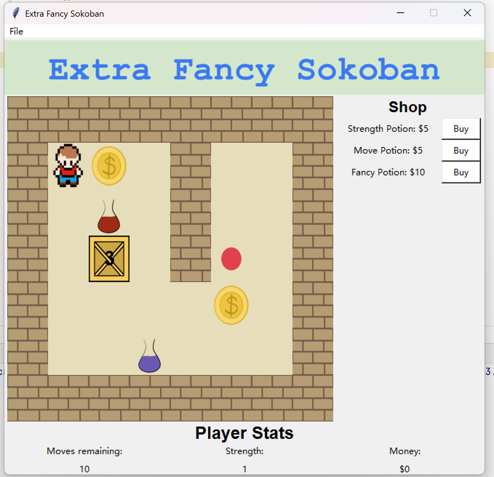
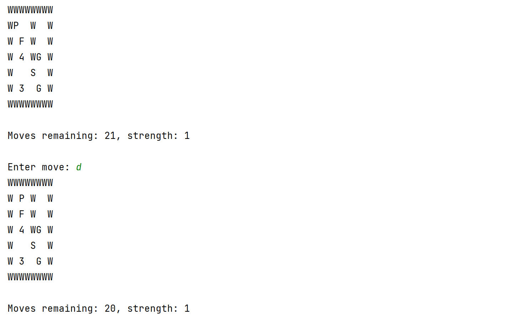
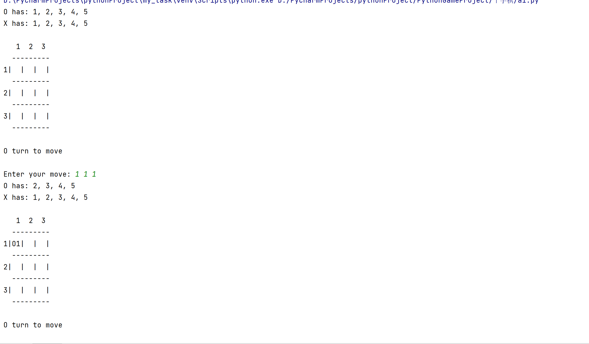
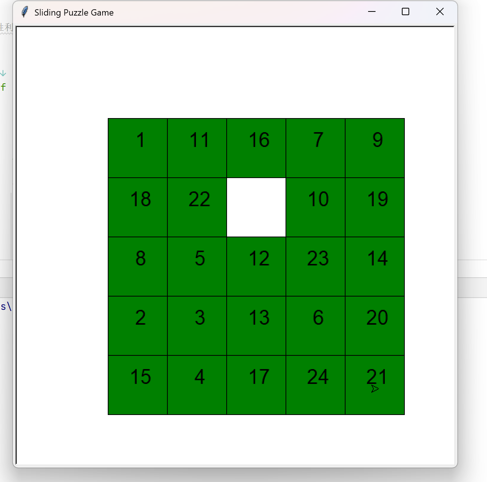
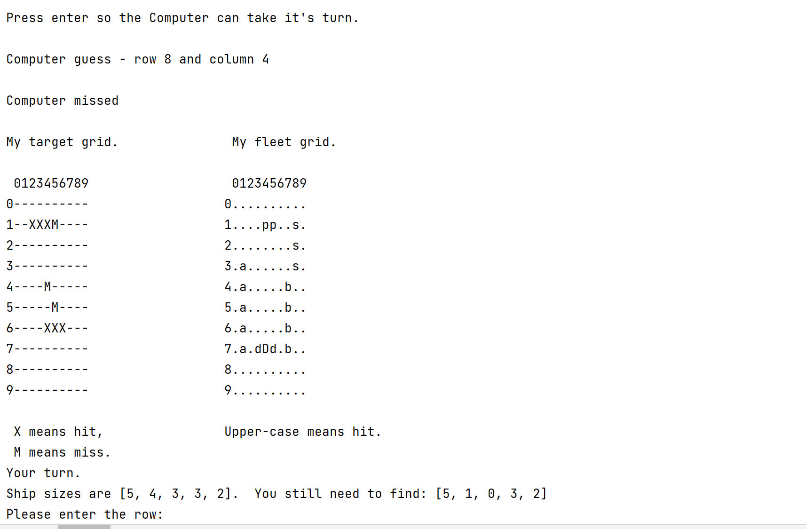

# Python小游戏集合
因为任务需要做的小游戏集合，感兴趣可以点击链接查看，包括不限于推箱子，华容道等小游戏
## 徽章

[](https://github.com/python/cpython)

---
## 游戏列表

- [推箱子(gui)](#推箱子(gui))
- [推箱子(console)](#推箱子(console))
- [战舰游戏](#战舰游戏)
- [华容道](#华容道)
- [十字棋游戏](#十字棋游戏)

---

## 推箱子(gui)

### 游戏描述
一个tkinter制作的推箱子游戏，支持键盘控制。wasd移动方块，有体力和力量限制，可获得金币获得药物，可以采用已有的地图，也可以自制地图和玩法。
- 运行入口:a3.py

### 游戏截图


## 推箱子(console)

### 游戏描述
和上面类似，在控制台移动，可悔棋
- 运行入口:a2.py

### 游戏截图


## 十字棋

### 游戏描述
简单十字棋游戏，玩家占据一条直线或者一条斜线获胜，玩家可覆盖对手的点位，前提是覆盖的点比被覆盖点位大，可在constants.py文件更改棋盘尺寸大小。
- 运行入口:a1.py

### 游戏截图



## 华容道
### 游戏描述
正常华容道玩法游戏，可更改尺寸，目前可选择3，4，5,其他尺寸可以在代码中更改
- 运行入口:1.py

### 运行截图



## 战舰游戏
### 游戏描述
每个战舰谜题代表了大海中的一个区域，在该区域中隐藏了一个舰队的数艘战舰，这些战舰可能是水平或者竖直排列，而且包含对角线在内，战舰之间不能相碰。网格右侧和底侧的数字代表了该行或者该列相应的被战舰覆盖的方格数。偶尔一些方格中已经显露出已知的战舰或水域的部分，这可以帮助你下手解题。游戏的目的是发现整个舰队的海上布局。

- 运行入口:play_battleship_game.py
### 游戏截图

---

## 如何运行游戏

1. 克隆仓库到本地机器
   ```shell
   git clone https://github.com/duanguolei/PythonGameProject.git
   ```

2. 进入游戏目录
   ```shell
   cd PythonGameProject
   ```

3. 安装依赖
   ```shell
   pip install -r requirements.txt
   ```

4. 运行游戏


